# **Modul 0**

## Software Installation

- WINDOWS
    - [XAMPP INSTALLATION FOR WINDOWS](#xampp-installation-for-windows)
    - [HOW TO CHANGE XAMPP PORT FOR WINDOWS](#how-to-change-xampp-port-for-windows)
- MAC OS
    - [XAMPP INSTALLATION FOR MAC OS](#xampp-installation-for-mac-os)
    - [HOW TO CHANGE XAMPP PORT FOR MAC OS](#how-to-change-xampp-port-for-mac-os)

---

### XAMPP INSTALLATION FOR WINDOWS

> 1. Open the following link, [Download XAMPP](https://www.apachefriends.org/download.html)
> 2. On the page, select the download section for Windows. Choose the latest 

> 3. Wait for the installer file to finish
> 4. When finished, open the downloaded installer file (if a warning appears click OK)
> 5. The XAMPP installation will look like this.

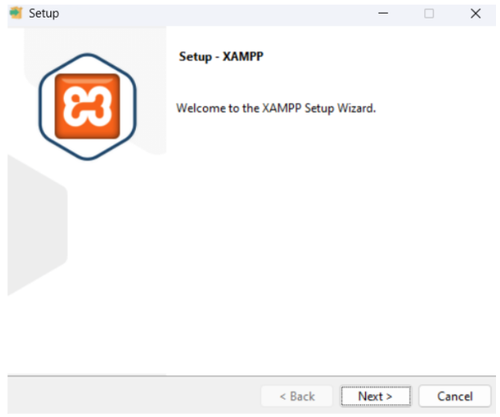

> 6. Click next

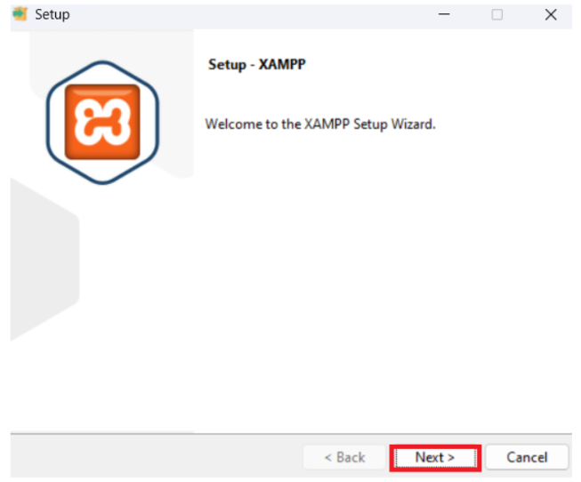

> 7. Leave the default checkbox option, then click next

> 8. Select the desired folder location, if not leave the default then click next

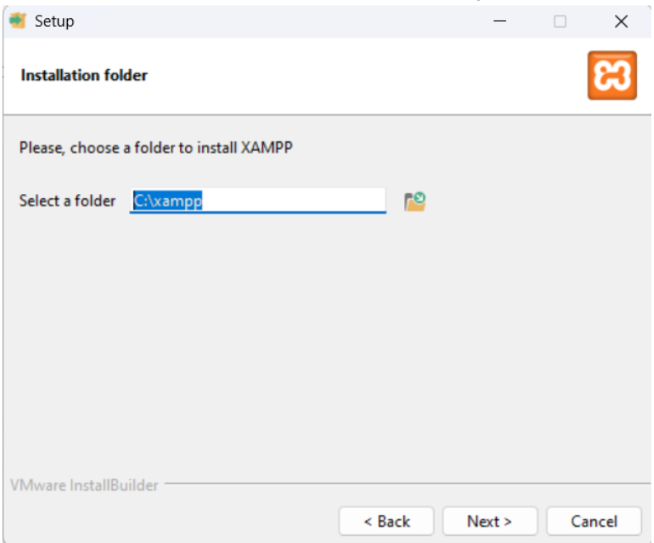

> 9. Select "English" language, then click next

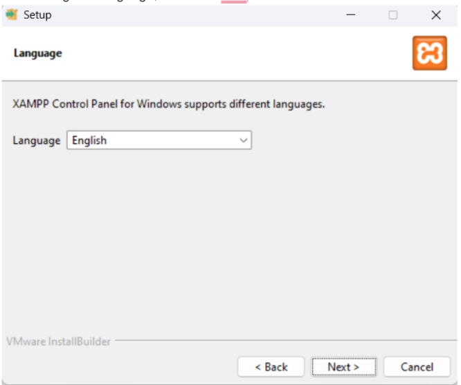

> 10. Click next

> 11. Wait until finished

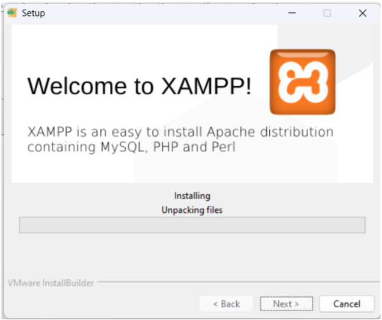

> 12. Click 

> 13. The following is a view of XAMPP for Windows

---

### HOW TO CHANGE XAMPP PORT FOR WINDOWS

> 1. In the xampp initial view, click the config menu on the actions menu tab. Then click Apache (httpd.conf)

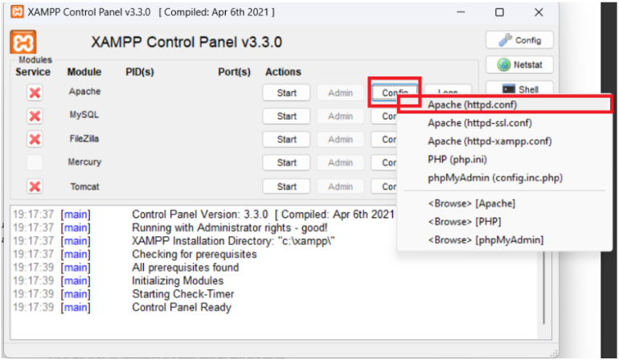

> 2. After the httpd.conf file appears, look for the code that says `Listen 80` and `ServerName localhost:80`. After that change the number **80 to 8080**, then save.

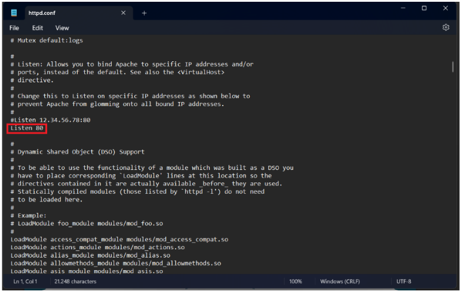

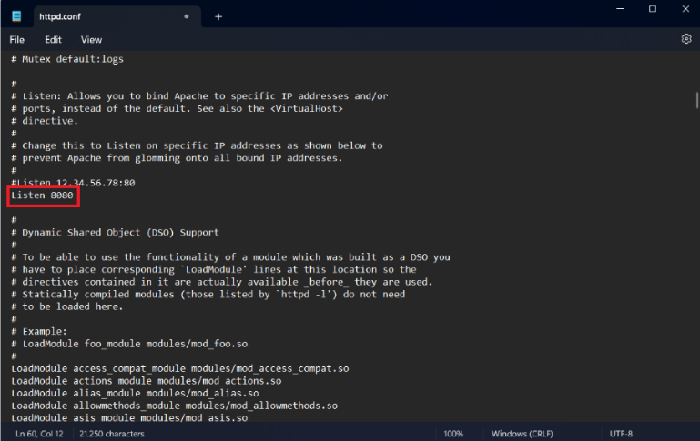

> 3. Next, change the apache port in the "**Service and Port Setting**" menu, then adjust the port to what was changed in the "httpd.conf" file earlier.

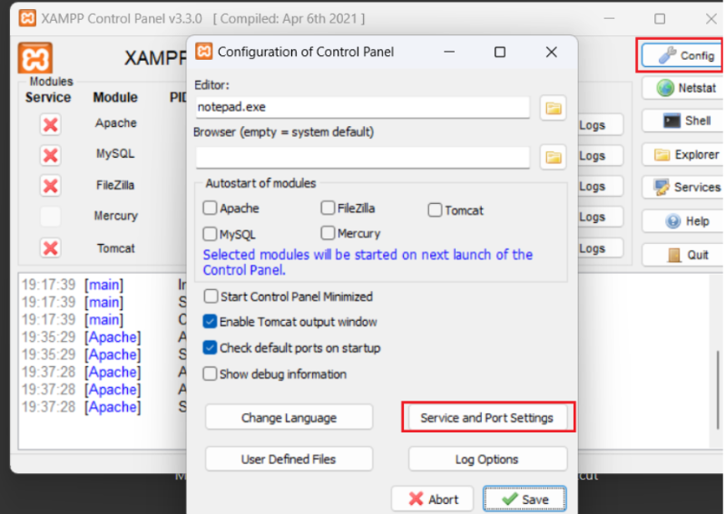

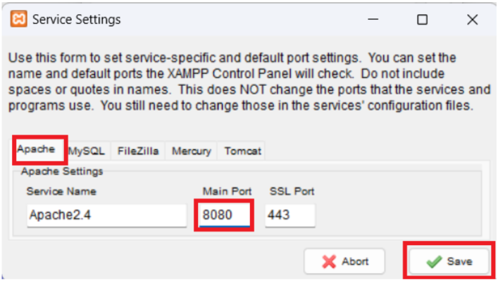

> 4. After saving, the port display in xampp has changed, then click stop.

> 5. To change the mysql port, it's the same as apache, just look for the code in "my.ini" in the mysql config that says `port=3306` and change it to `port=3308`

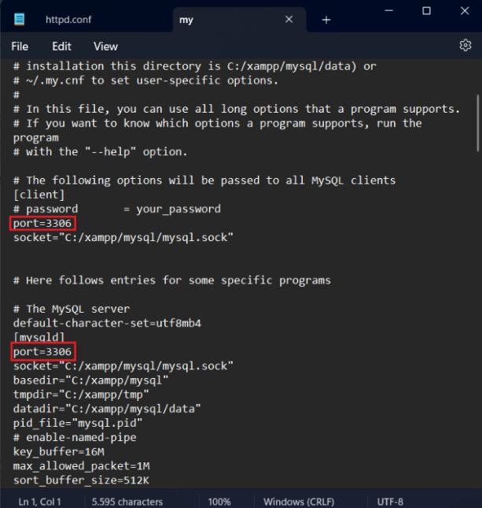

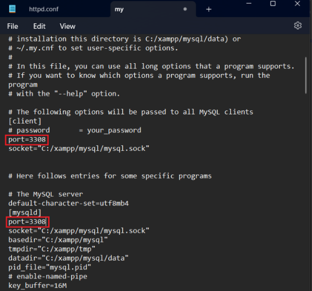

> 6. After saving, don't forget to change the mysql port in the xampp config as you did with the apache port earlier.

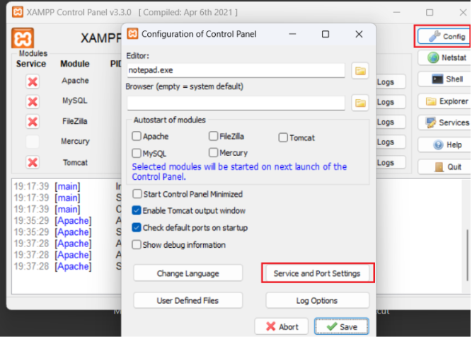

> 7. Then open a browser and type **localhost:8080**
> 8. Then it will look like this

> 9. Next, click phpmyadmin. Then it will look like this and phpmyadmin can be 

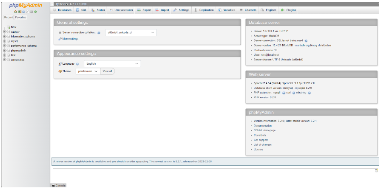

---

### XAMPP INSTALLATION FOR MAC OS

> 1. Go to the following link, [Download XAMPP](https://www.apachefriends.org/download.html)

> 2. On the page, select the download section for OS X. Select the latest version.

> 3. Wait for the installer file to finish
> 4. When finished, open the downloaded installer file and click to install.

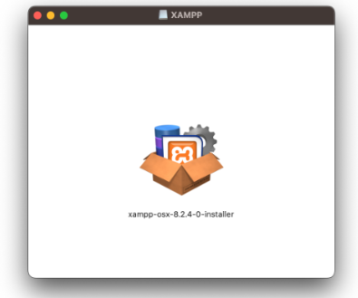

> 5. The XAMPP installation display will be like this. Then, click next.

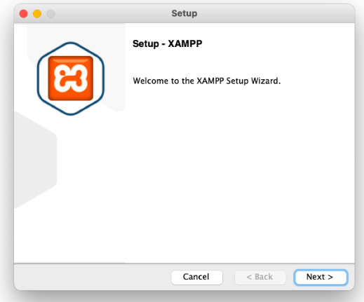

> 6. Leave the default component selected, then click next.

> 7. The installer will display the directory of the application to be installed, then click next.

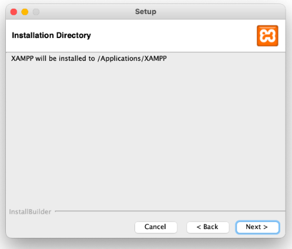

> 8. Click next to start the installation.

> 9. Wait for the installation process to finish.

> 10. Once the installation process is complete, click finish.

> 11. The following is a view of XAMPP for Mac OS.

---

### HOW TO CHANGE XAMPP PORT FOR MAC OS

> 1. In the xampp initial view, click Apache Web Server and then click Configure. Then open Conf File.

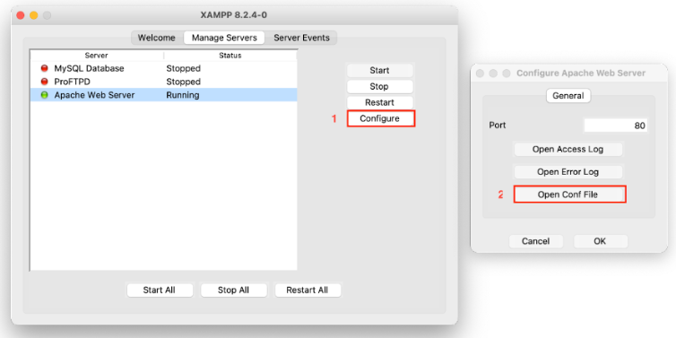

> 2. After the httpd.conf file appears, look for the code that says `Listen 80` and `ServerName localhost:80`. After that change the number **80 to 8080**, then save.

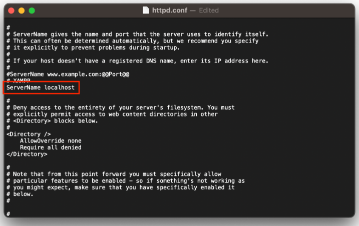

> 3. Next, change the apache port in the "**Service and Port Setting**" menu, then adjust the port to what was changed in the "httpd.conf" file earlier.

> 4. To change the mysql port, it's the same as apache, just look for the code in "my.cnf" in the mysql config that says `port=3306` and change it to `port=3308`.

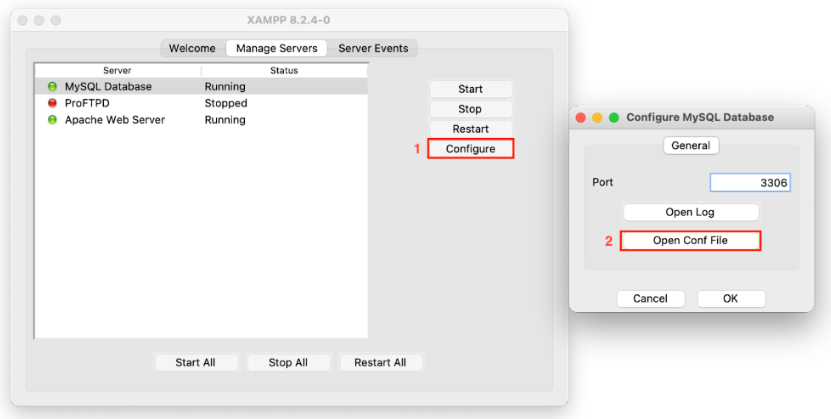

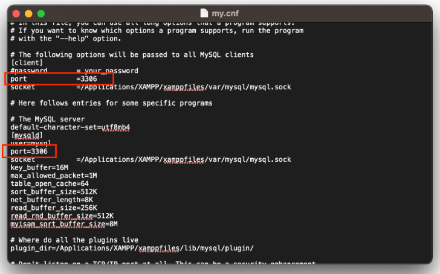

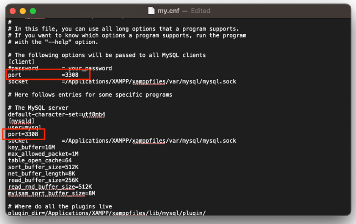

> 5. Next, change the MySQL port, then adjust the port to what was changed in the "my.cnf" file earlier

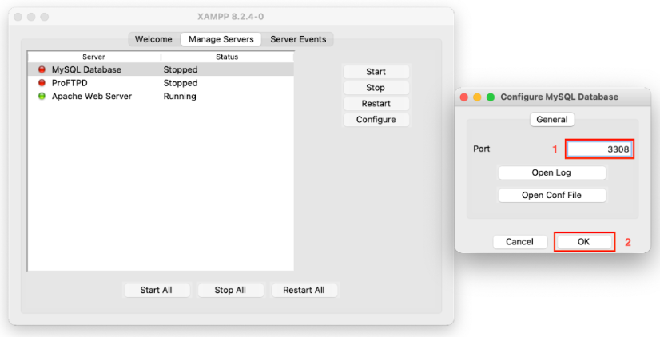

> 6. Start MySQL Database, then run the application

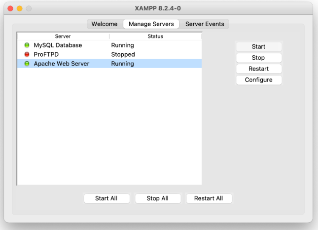

> 7. Then it will look like this

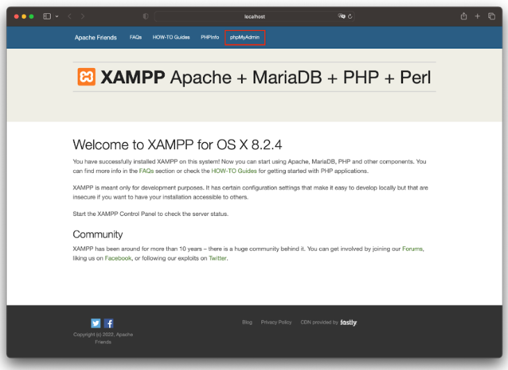

> 8. Next, click phpmyadmin. Then it will look like this and phpmyadmin can be used

