# **Modul 0**

## Instalasi Perangkat Lunak

- WINDOWS
    - [INSTALASI XAMPP UNTUK WINDOWS](#instalasi-xampp-untuk-windows)
    - [CARA MENGGANTI PORT XAMPP WINDOWS](#cara-mengganti-port-xampp-windows)
- MAC OS
    - [INSTALASI XAMPP UNTUK MAC OS](#instalasi-xampp-untuk-mac-os)
    - [CARA MENGGANTI PORT XAMPP MAC OS](#cara-mengganti-port-xampp-mac-os)

---

### INSTALASI XAMPP UNTUK WINDOWS

> 1. Buka link berikut, [Download XAMPP](https://www.apachefriends.org/download.html)
> 2. Pada halaman tersebut, pilih pada bagian download untuk Windows. Pilih versi yang terbaru

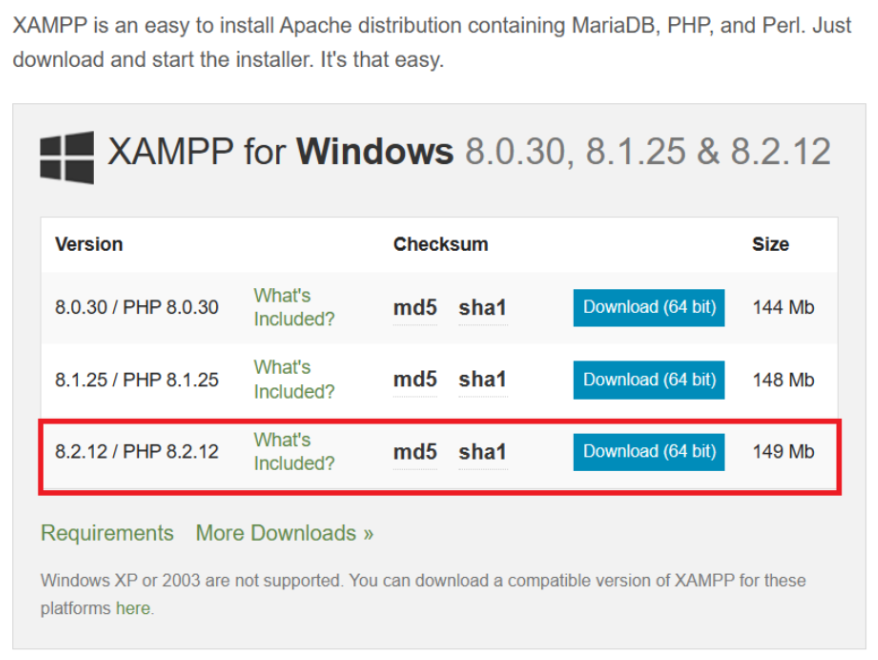

> 3. Tunggu hingga file installernya selesai
> 4. Jika sudah selesai, buka file installer yang sudah didownload (jika muncul peringatan klik OK)
> 5. Jika sudah, maka tampilan instalasi XAMPP akan seperti ini.

> 6. Klik next

> 7. Biarkan pilihan ceklis yang default, lalu klik next

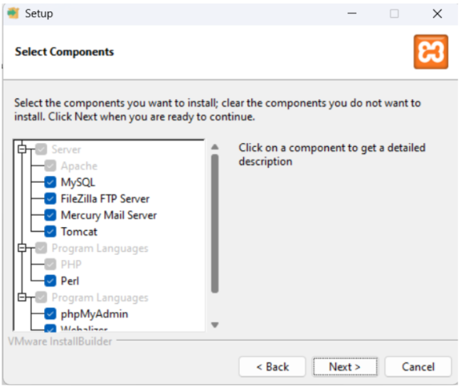

> 8. Pilih lokasi folder yang diinginkan, jika tidak biarkan default lalu klik next

> 9. Pilih language “English”, lalu klik next

> 10. Klik next

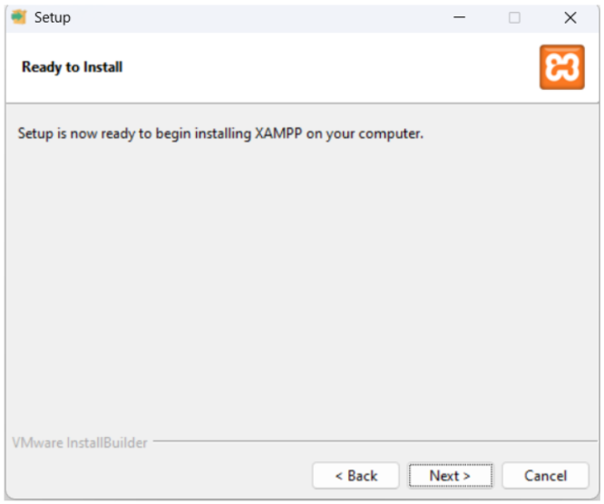

> 11. Tunggu sampai selesai

> 12. Klik finish

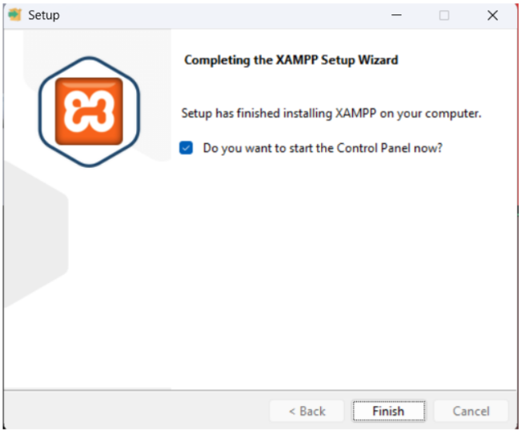

> 13. Berikut merupakan tampilan XAMPP untuk Windows

---

### CARA MENGGANTI PORT XAMPP WINDOWS

> 1. Pada tampilan awal xampp, klik menu config pada bagian tab menu actions. Lalu klik Apache (httpd.conf)

> 2. Setelah file httpd.conf muncul, cari kode yang bertuliskan `Listen 80` dan `ServerName localhost:80`. Setelah itu ubah angka **80 menjadi 8080**, lalu save.

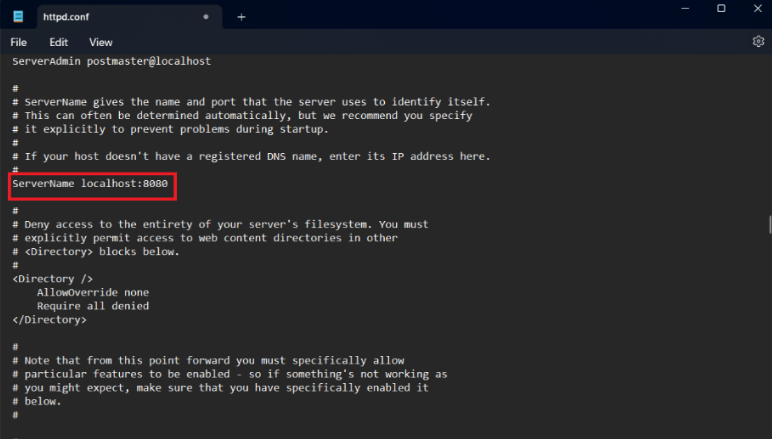

> 3. Selanjutnya, ubah port apache pada menu “**Service and Port Setting**”, lalu sesuaikan port dengan yang telah diubah pada file “httpd.conf” tadi

> 4. Setelah di save, tampilan port di xampp telah berubah, lalu klik stop

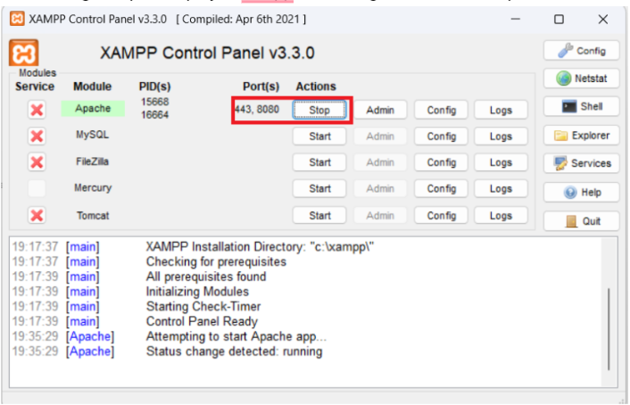

> 5. Untuk mengganti port mysql sama seperti apache, hanya saja cari code di “my.ini” pada config mysql yang bertuliskan `port=3306` dan diubah menjadi `port=3308`

> 6. Setelah disave, jangan lupa untuk mengubah port mysql di config xampp seperti yang dilakukan pada port apache sebelumnya

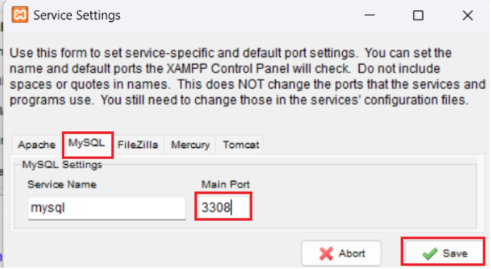

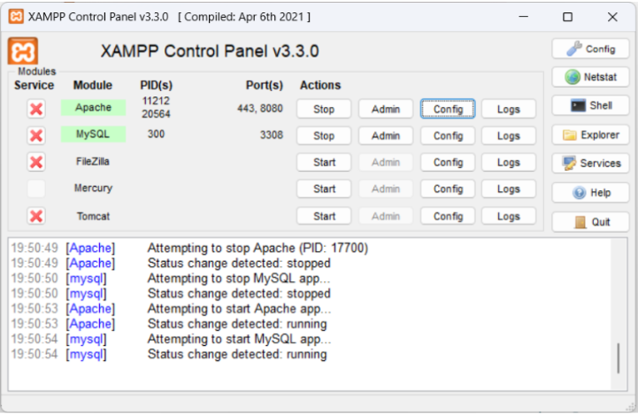

> 7. Lalu buka browser dan ketik **localhost:8080**
> 8. Maka tampilannya akan seperti ini

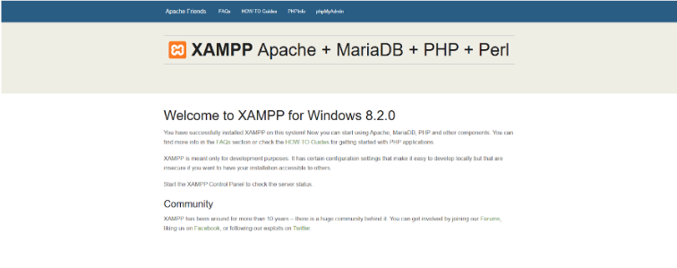

> 9. Selanjutnya, klik phpmyadmin. Maka tampilannya akan seperti ini dan phpmyadmin sudah dapat digunakan

---

### INSTALASI XAMPP UNTUK MAC OS

> 1. Buka link berikut, [Download XAMPP](https://www.apachefriends.org/download.html)
> 2. Pada halaman tersebut, pilih pada bagian download untuk OS X. Pilih versi yang terbaru.

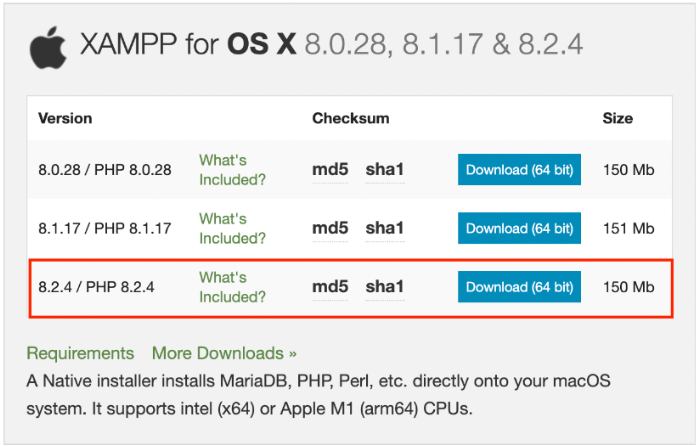

> 3. Tunggu hingga file installernya selesai
> 4. Jika sudah selesai, open file installer yang sudah dilakukan download dan klik untuk melakukan installasi

> 5. Jika sudah, maka tampilan instalasi XAMPP akan seperti ini. Lalu, klik next.

> 6. Biarkan komponen default terpilih, lalu klik next.

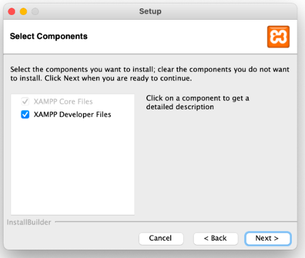

> 7. Installer akan menampilkan direktori aplikasi yang akan dilakukan penginstallan, lalu klik next.

> 8. Klik next untuk memulai install.

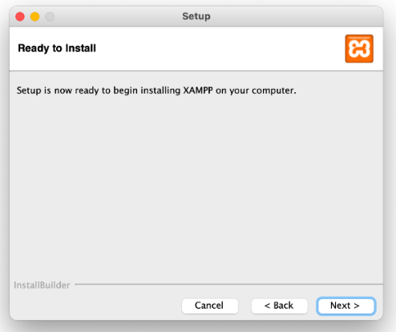

> 9. Tunggu sampai proses instalasi selesai.

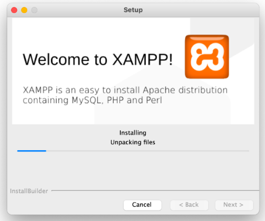

> 10. Setelah proses instalasi selesai, klik finish.

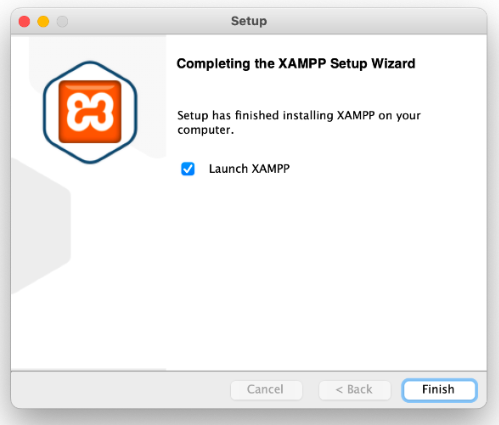

> 11. Berikut merupakan tampilan XAMPP untuk Mac OS.

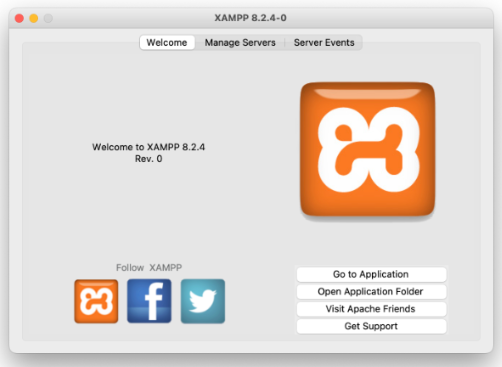

---

### CARA MENGGANTI PORT XAMPP MAC OS

> 1. Pada tampilan awal xampp, klik Apache Web Server lalu klik Configure. Kemudian buka Conf File.

> 2. Setelah file httpd.conf muncul, cari kode yang bertuliskan `Listen 80` dan `ServerName localhost:80`. Setelah itu ubah angka **80 menjadi 8080**, lalu save.

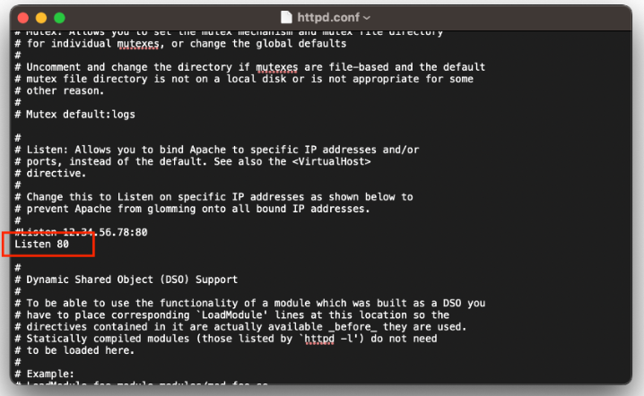

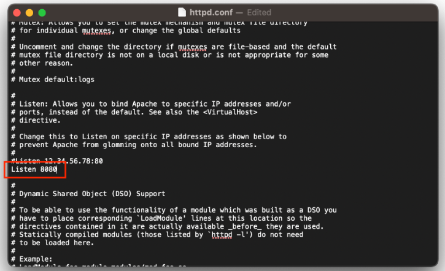

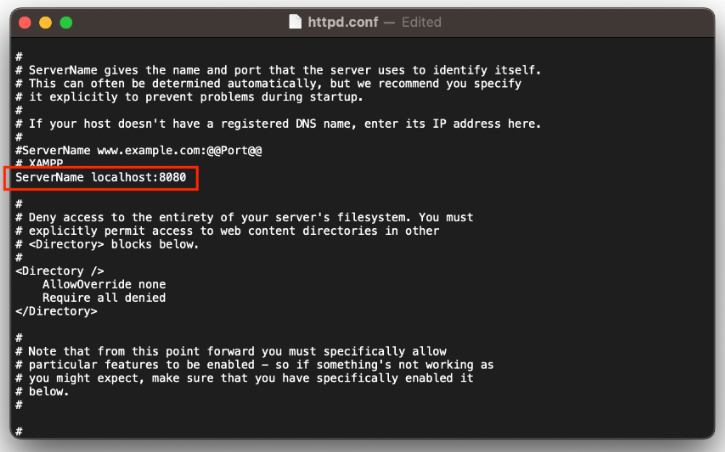

> 3. Selanjutnya, ubah port apache pada menu “**Service and Port Setting**”, lalu sesuaikan port dengan yang telah diubah pada file “httpd.conf” tadi

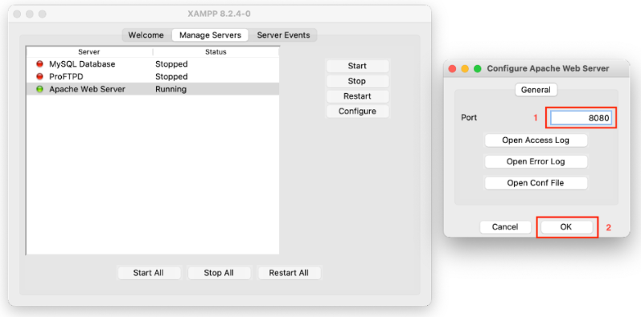

> 4. Untuk mengganti port mysql sama seperti apache, hanya saja cari code di “my.cnf” pada config mysql yang bertuliskan `port=3306` dan diubah menjadi `port=3308`

> 5. Selanjutnya, ubah port MySQL, lalu sesuaikan port dengan yang telah diubah pada file “my.cnf” tadi

> 6. Start MySQL Database, lalu jalankan aplikasi

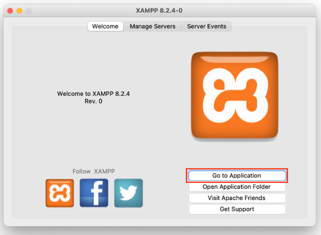

> 7. Maka tampilannya akan seperti ini

> 8. Selanjutnya, klik phpmyadmin. Maka tampilannya akan seperti ini dan phpmyadmin sudah dapat digunakan

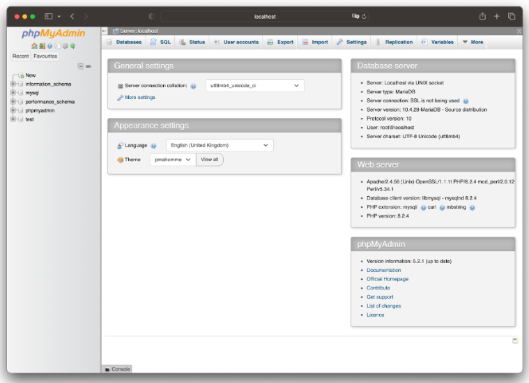