# **MODULE 2**

## A. INTRODUCTION DATA MANIPULATION LANGUAGE
DML stands for Data Manipulation Language. It is a subset of SQL (Structured Query Language) with its main commands of SELECT, INSERT, DELETE, and UPDATE used to modify, insert, update, and delete data in a relational database. DML commands are used to interact with data stored in database tables.
DML commands are essential for managing and maintaining the integration of a database. By using DML commands, users can ensure that the data stored in the database is accurate, up-to-date, and relevant to their needs.

## B. COMMANDS IN DATA MANIPULATION LANGUAGE 
### 1. SELECT
SELECT is a DML command used to select and display values in a table. 
Here are the syntax for writing the SELECT command:

-**Display all data**

```sql
SELECT * FROM nama_tabel;
```
<p align="center">

</p>

-**Display data in a specific column**

```sql
SELECT column-1, column-2, ..., column-n
FROM table_name;
```
<p align="center">

</p>

-**Display data on a specific condition**

```sql
SELECT column-1, column-2, ..., column-n
FROM table_name
WHERE condition;
```
<p align="center">

</p>

-**Display data based on different values only**

```sql
SELECT DISTINCT column-1, column-2, ..., column-n
FROM table_name;
```
<p align="center">

</p>

-**Display data in order**

```sql
SELECT column-1, column-2, ..., column-n
FROM table_name
ORDER BY column_name ASC/DESC;
```

<p align="center">

</p>

<br> 
(ASC: Displays data from the smallest value to the largest. DESC: displays data from the largest value to the smallest.)
<br>
<br>
Besides the syntax above, there are some additional commands that can be added to the SELECT command as follows:

-**Display columns with other names**

```sql
SELECT column_name AS alias_name
FROM table_name;
```

<p align="center">

</p>

-**Combine and display two columns**

```sql
SELECT CONCAT(column-1, column-2)
FROM table_name;
```

<p align="center">

</p>

### 2. INSERT
INSERT is a DML command used to add data to a table. Here are the syntax for writing the INSERT command:

-**Add data with specific columns and values**

```sql
INSERT INTO nama_tabel (column-1, column-2, ..., column-n)
VALUES (value-1, value-2, ..., value-n);
```

<p align="center">

</p>

-**Add data by simply calling the value without calling the column name**

```sql
INSERT INTO table-name
VALUES (value-1, value-2, ..., value-n);
```

<p align="center">

</p>

-**Add multiple rows of data at once**

```sql
INSERT INTO name_table (column-1, column-2, ..., column-n)
VALUES (value-1, value-2, ..., value-n), (value-1, value-2, ..., value-n);
```

<p align="center">

</p>

### 3. UPDATE
UPDATE is a command that functions to change or 
update data that already exists in the table. The following is the syntax used in the UPDATE command.

```sql
UPDATE name_table 
SET column-1 = value-1, column-2 = value-2, column-n = value-n 
WHERE condition;
```

<p align="center">

</p>

### 4. DELETE
DELETE as the name suggests is a command that functions to delete data in the table. The following is the syntax used to perform the DELETE command.

```sql
DELETE FROM name_table 
WHERE condition;
```

<p align="center">

</p>

## C. LOGIC OPERATORS
### 1. AND
The AND operator is used to return a data record if both conditions are true. Here is the syntax used to use the AND operator.

```sql
SELECT * FROM table-name 
WHERE condition-1 AND condition-2 AND condition-n;
```

<p align="center">

</p>

### 2. IN 
The IN operator is used to replace repeated OR conditions in SELECT, INSERT, UPDATE, or DELETE. We can also use NOT IN to minimize the list in the data rows we use. Here is the syntax used to use the IN operator.

```sql
SELECT * FROM table_name
WHERE coulmn_name IN (value-1, value-2, …, value-3);
```

<p align="center">

</p>

### 3. OR
The OR operator is used to return a data record if one of the given conditions is true. Here is the syntax used to use the OR operator.

```sql
SELECT * FROM table-name
WHERE condition-1 OR condition-2 OR condition-n;
```

<p align="center">

</p>

### 4. NOT 
The NOT operator is used to return a data record if the condition given is not true. Here is the syntax used to use the NOT operator.

```sql
SELECT * FROM table_name
WHERE NOT condition
```

### 5. LIKE
The LIKE operator is used together with the WHERE syntax to search for a specified pattern in a column. Here is the syntax used to use the LIKE operator

-** % used for zero or more than one character**

```sql
SELECT * FROM table_name
WHERE column_name LIKE '(character)%';
```

<p align="center">

</p>

## D. SET OPERATIONS
### 1. UNION (∪)
UNION is an operator that returns values from two or more tables by combining SELECT statements without returning duplicate values. 
There are several rules for using UNION, such as the columns in the combined tables must have the same number and data types, and the order of columns in the combined tables must also be the same.

```sql
SELECT column-1, column-2, ..., column-n
FROM table_name
WHERE condition

UNION

SELECT column-1, column-2, ..., column-n
FROM table_name
WHERE condition;
```

<p align="center">
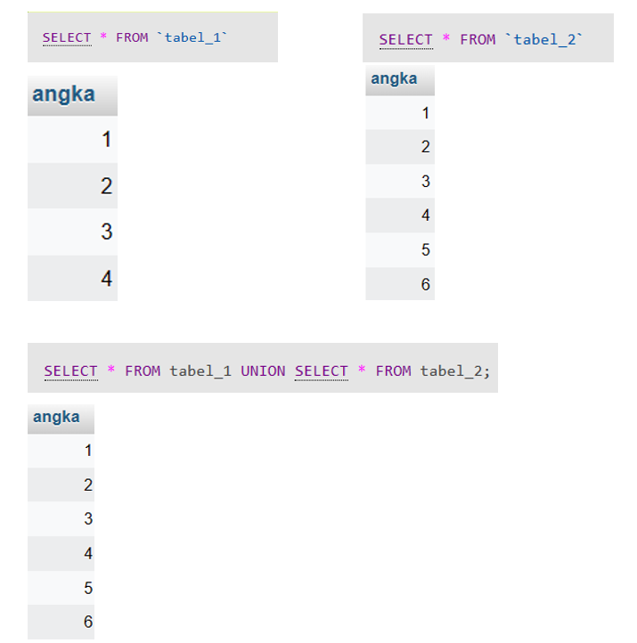
</p>

UNION ALL is an operator that returns values from two or more tables by combining SELECT statements while returning its duplicate values. 
The difference between UNION and UNION ALL lies in the returning of values; UNION doesn't return its duplicate values, whereas UNION ALL does.

```sql
SELECT column-1, column-2, ..., column-n
FROM table_name
WHERE condition

UNION ALL

SELECT column-1, column-2, ..., column-n
FROM table_name
WHERE condition;
```

<p align="center">

</p>

### 2. INTERSECT (∩)
INTERSECT is an operator that takes the intersection of two SELECT statements.

```sql
SELECT column-1, column-2, ..., column-n
FROM table_name
WHERE column_name IN(
SELECT column-1, column-2, ..., column-n
FROM table_name);
```
<p align="center">
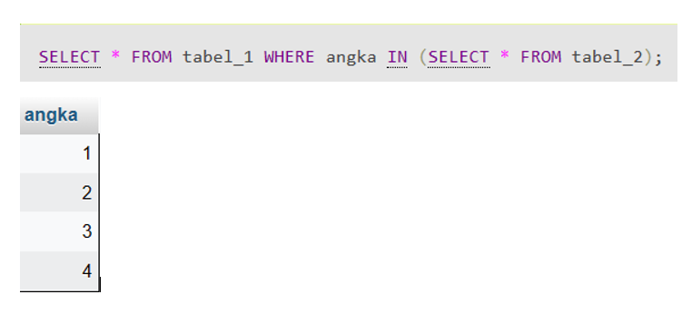
</p>

### 3. EXCEPT (-)
EXCEPT is an operator that only returns unique or exclusive data from the first table but not found in the second table. The term "unique or exclusive data" refers to data that has no equivalent in the second table.

```sql
SELECT column-1, column-2, ..., column-n
FROM table_name
WHERE column_name NOT IN(
SELECT column-1, column-2, ..., column-n
FROM table_name);
```
<p align="center">
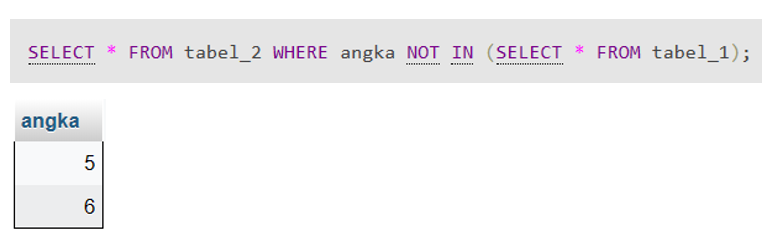
</p>

## E. ARITHMETIC OPERATORS
Arithmetic Operators in SQL are used to perform simple arithmetic operations such as addition (+), subtraction (-), multiplication (*), division (/), and modulus (%).
### 1. Addition (+)
Addition is used to add two values.
```sql
SELECT column1, column2, column2 + number FROM table_name;
```
<p align="center">
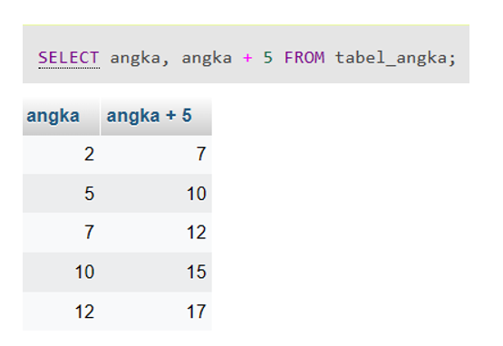
</p>

### 2. Subtraction (-) 
Subtraction is used to subtract one value from another.
```sql
SELECT column1, column2, column2 - number FROM name_table;
```
<p align="center">
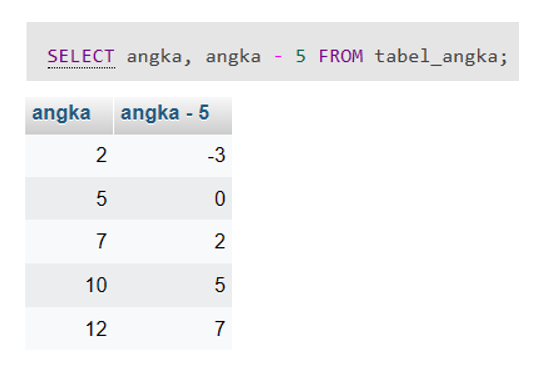
</p>

### 3. Multiplication (*)
Multiplication is used to multiply two values.
```sql
SELECT column1, column2, column2 * number FROM table_name;
```
<p align="center">
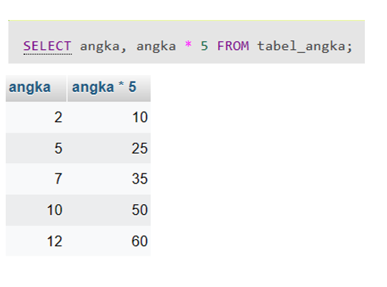
</p>


### 4. Division (/)
Division is used to divide one value with another value.
```sql
SELECT column1, column2, column2 / number FROM name_table;
```
<p align="center">
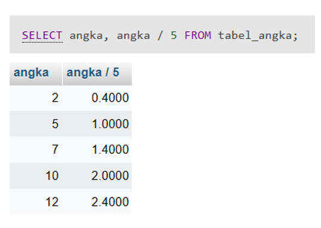
</p>

### 5. Modulus (%)
Modulus is used to obtain the remainder of the division operation between two values.
```sql
SELECT column1, column2, column2 % number FROM table_name;
```
<p align="center">
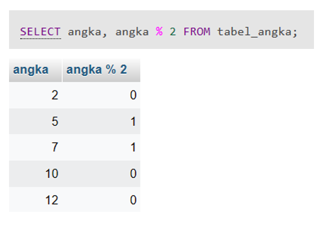
</p>

## F. AGGREGATE OPERATORS
Aggregate operators, commonly known as aggregate functions, are operators used to summarize data within a table. These operators can be used in various DML statements, such as SELECT, GROUP BY, etc.
### 1. SUM
SUM is used to calculate the total value within a column.
```sql
SELECT SUM(column_name) FROM table_name;
```
<p align="center">
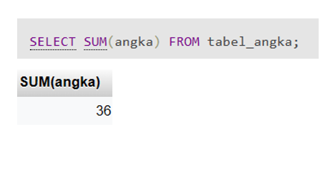
</p>

### 2. AVG
AVG is used to calculate the average value within a column.
```sql
SELECT AVG(column_name) FROM table_name;
```
<p align="center">
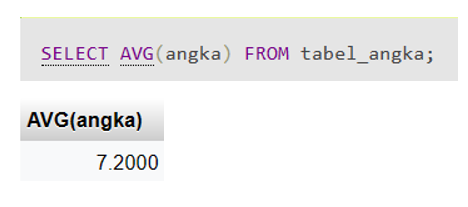
</p>


### 3. MIN
MIN is used to find the minimum value in a column.
```sql
SELECT MIN(column_name) FROM table_name;
```
<p align="center">
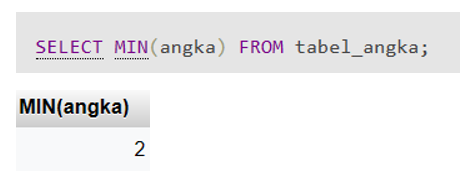
</p>


### 4. MAX
MAX is used to find the maximum value in a column.
```sql
SELECT MAX(column_name) FROM table_name;
```
<p align="center">
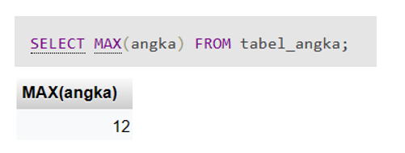
</p>


### 5. COUNT
COUNT is used to count the number of rows in a table.
```sql
SELECT COUNT(column_name) FROM table_name;
```
<p align="center">
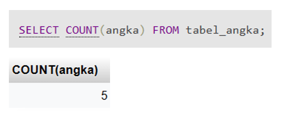
</p>

## G. SUBQUERY
A subquery, also known as a nested query or subselect, is a form of query embedded within another query using the SELECT, WHERE, or FROM clauses. The purpose of a subquery is to generate data that will be used in the main query to limit or filter the data to be retrieved. Subqueries are used to provide additional conditions or criteria in the data retrieval process. Here are some rules for using subqueries:


Subqueries must be enclosed in parentheses.
- The use of the ORDER BY clause is not allowed in subqueries. The ORDER BY clause can be used in the main SELECT statement.
- The SELECT clause in a subquery must contain a single column name or expression, except for subqueries using the EXISTS keyword.
- By default, column names in a subquery refer to the table names in the FROM clause of the main query by qualifying the column names.
- Subqueries cannot be used as operands in expressions.

```sql
SELECT column_name
FROM table_name
WHERE column_name operator
      (SELECT column_name
      FROM table_name
      WHERE column_name operator);
```
Here is an example of using a subquery:


The database "data_mahasiswa" consists of three tables: mahasiswa, nilai_mahasiswa, and mata_kuliah.
<p align="center">
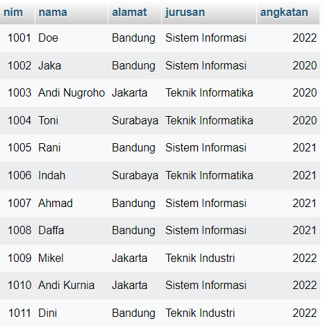
      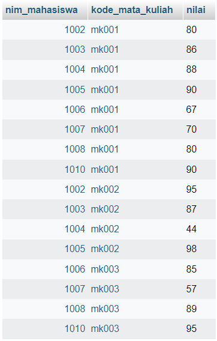
      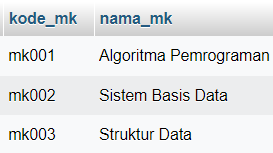
</p>

```sql
SELECT nama
FROM mahasiswa
WHERE nim IN
      (SELECT nim_mahasiswa
       FROM nilai_mahasiswa
       WHERE nilai > 80 AND kode_mata_kuliah = 'mk001');
```

This query is employed to retrieve the names of students from the "mahasiswa" table who meet specific conditions. The embedded subquery serves the purpose of finding student IDs from the "nilai_mahasiswa" table with grades exceeding 80 and associated with the course code “mk001”. The outcome of this subquery, which comprises the qualifying student IDs, is then used as criteria in the main query. Using the WHERE clause and the IN operator, the main query extracts the names of students whose student IDs match the results of the subquery. Therefore, the final result of this query is a list of student names who fulfill the criteria of having a grade above 80 in the course “mk001”.

<p align="center">

</p>

## H. COMPARISON OPERATORS
### 1. Wildcard
Wildcard is a special character used in search or data filtering operations. Wildcards allow users to match specific patterns within data values, providing additional flexibility in query or search conditions.
<br>

| Symbol        | Usage    | Example      |
| :------------- |:-------------| :-------------|
| %      | Represents zero, one, or more characters |‘baju%’ will find ‘bajubiru’, ‘bajumerah’|
| _      | Represents a single character |‘p_t’ will find ‘pat’, ‘pet’, ‘pit’, ‘pot’, ‘put’|
| [ ]      | Represents any single character within square brackets |‘p[ao]t’ will find ‘pat’ and ‘pot’|
| ^      | Represents any character not in square brackets |‘p[^ao]t’ will find pet’, ‘pit’, ‘put’, but not ‘pat’ and ‘pot’|
| -      | Represents a range of characters |c[a-d] will find cat, cbt, cct, and cdt|.

```sql
SELECT * FROM table_name WHERE column_name LIKE 'baju%'; will show rows that have column values starting with "baju."
```

### 2. BETWEEN
BETWEEN is used to return values within a specified range.

```sql
SELECT column_name FROM table_name WHERE column_name BETWEEN
value-1 AND value-2;
```

### 3. IN
IN is used to compare data with a predefined list, filtering results based on a set of values that match specific conditions.

```sql
SELECT * FROM table_name WHERE column_name IN (condition-1,
condition-2, ..., condition-n);
```


### 4. DISTINCT
DISTINCT is used to return unique values from the query results by eliminating records that contain duplicate data when displaying the data.

```sql
SELECT DISTINCT column_name FROM table_name;
```

### 5. LIMIT
LIMIT is used to restrict the number of rows to be displayed.

```sql
SELECT column_name FROM table_name LIMIT number;
```

### 6. IS NULL
IS NULL is used to check if a column has an empty value (NULL).

```sql
SELECT column_name FROM table_name WHERE column_name IS
NULL;
```

### 7. GROUP BY
GROUP BY is used to group data according to specified criteria.

```sql
SELECT column_name FROM table_name GROUP BY column_name;
```

### 8. ORDER BY
ORDER BY is used to arrange query results based on values in one or more columns. Data sorting can be done in ascending (from smallest to largest) or descending (from largest to smallest) order.

```sql
SELECT column_name FROM table_name ORDER BY column_name
ASC/DESC;
```

## I. SQL JOIN
### 1. CROSS JOIN
CROSS JOIN is a type of join that produces the cross product of two tables. The resulting table from CROSS JOIN will contain all possible combinations of rows from both tables, and each row in the result table will encompass all attributes (columns) from the first and second tables.

```sql
SELECT * FROM table-1 AS alias-1 CROSS JOIN table-2 AS alias-2;
```

Example:

```sql
SELECT *
FROM mahasiswa AS tb_mahasiswa
CROSS JOIN mata_kuliah AS tb_mk;
```

<p align="center">
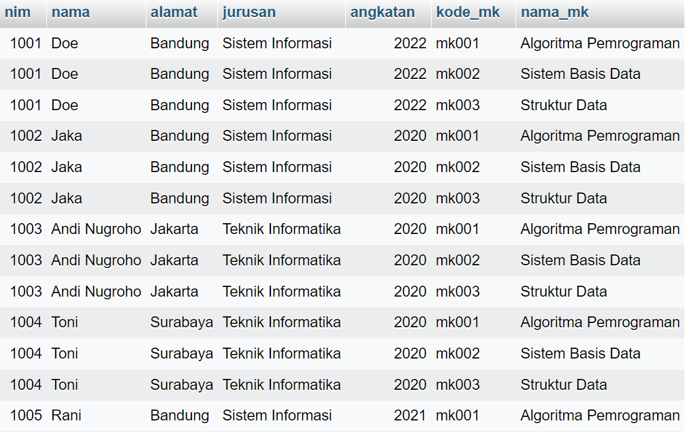
</p>

### 2. RIGHT JOIN
RIGHT JOIN is a type of join that retrieves all rows from the right table and matching rows from the left table. If there is no match, columns from the left table will contain NULL values.

```sql
SELECT column-1, column-2, .., column-n
FROM table-1
RIGHT JOIN table-2
ON table-1.column_name = table-2.column_name;
```

<p align="center">

</p>

Example:

```sql
SELECT mahasiswa.nim, mahasiswa.nama, nilai_mahasiswa.kode_mata_kuliah, nilai_mahasiswa.nilai
FROM mahasiswa
RIGHT JOIN nilai_mahasiswa 
ON mahasiswa.nim = nilai_mahasiswa.nim_mahasiswa;
```

<p align="center">
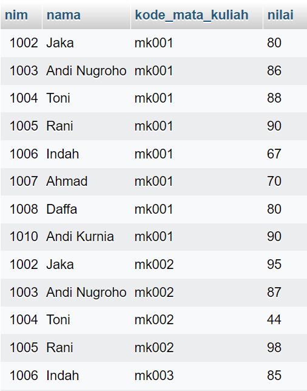     
</p>

### 3. LEFT JOIN
LEFT JOIN retrieves all rows from the left table and matching rows from the right table. If there is no match, columns from the right table will contain NULL values.

```sql
SELECT column-1, column-2, .., column-n
FROM table-1
LEFT JOIN table-2
ON table-1.column_name = table-2.column_name;
```

<p align="center">
      
</p>

Example:

```sql
SELECT mahasiswa.nim, mahasiswa.nama, nilai_mahasiswa.kode_mata_kuliah, nilai_mahasiswa.nilai
FROM mahasiswa
LEFT JOIN nilai_mahasiswa 
ON mahasiswa.nim = nilai_mahasiswa.nim_mahasiswa;
```

<p align="center">
      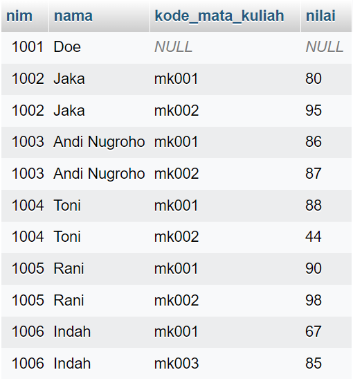
</p>

### 4. INNER JOIN
INNER JOIN retrieves rows from both tables that have matching values based on the provided condition. Rows without a match are ignored.

```sql
SELECT a.column_name-1, b.column_name-2
FROM table-1 a
JOIN table-2 b
ON a.column_name = b.column_name;
```

<p align="center">
      
</p>

Alternatively, you can use the WHERE clause as follows:

```sql
SELECT a.column_name-1, b.column_name-2
FROM table-1 a, table-2 b
WHERE a.column_name = b.column_name;
```

Explanation:
- a is an alias for table 1
- b is an alias for table 2
- ON is used to access keys from each table by connecting both tables with a mention of the same column in each table

Example:

```sql
SELECT tb_nilai.nim_mahasiswa, tb_matakuliah.nama_mk, tb_nilai.nilai
FROM nilai_mahasiswa tb_nilai
JOIN mata_kuliah tb_matakuliah
ON tb_nilai.kode_mata_kuliah = tb_matakuliah.kode_mk;
```

<p align="center">
      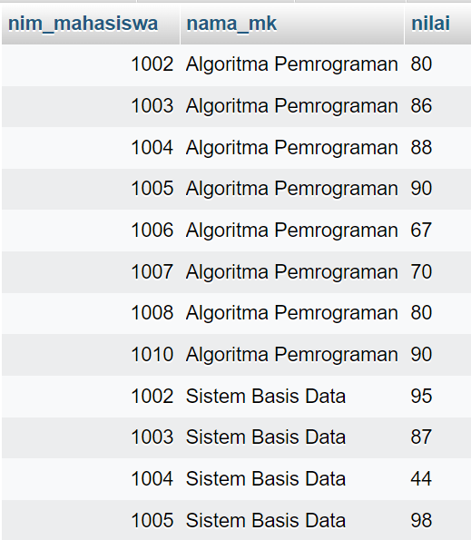
</p>

## J. HOW TO IMPORT A DATABASE
### 1. Prepare the database file in .sql format that will be imported.
### 2. Open phpMyAdmin.
### 3. Create a new database.

<p align="left">
      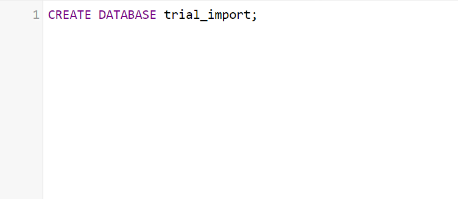


### 4. Select the 'Import' tab and then choose the .sql file to be imported.

<p align="left">
      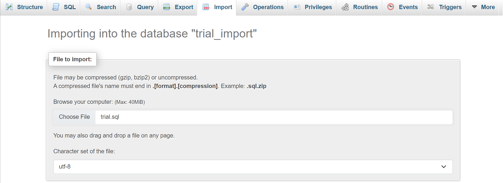
      
### 5. Click the 'Import' button located at the bottom of the page.

<p align="left">
      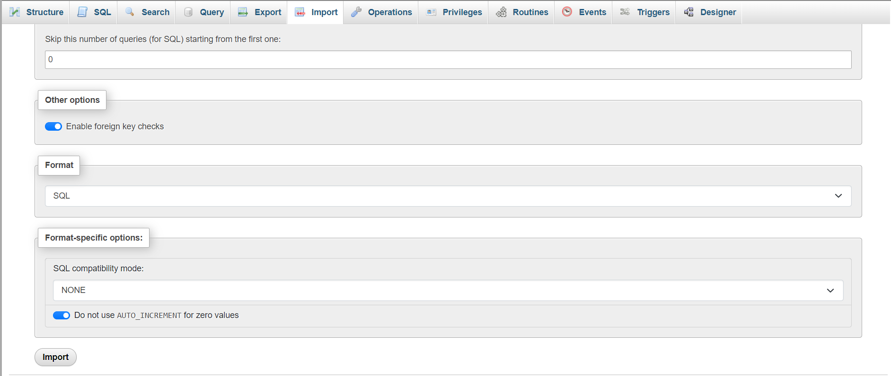
      
### 6. If a success notification appears, the database import process has been successfully completed.

<p align="left">
      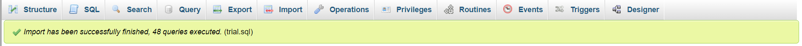


