# **MODUL 2**
##### Table of Content
- ### [**Cara Import Database di PHPMYADMIN**](https://github.com/lifeatedmlab/praktikum-basis-data/blob/main/MODUL%202/MODUL2-IND.md#cara-import-database)
- ### [*Pengenalan Data Manipulation Language* (DML)](https://github.com/lifeatedmlab/praktikum-basis-data/blob/main/MODUL%202/MODUL2-IND.md#a-pengenalan-data-manipulation-language)
- ### [**Perintah DML pada Database MySQL**](https://github.com/lifeatedmlab/praktikum-basis-data/blob/main/MODUL%202/MODUL2-IND.md#b-perintah-pada-data-manipulation-language)
- ### [**Operasi Logika**](https://github.com/lifeatedmlab/praktikum-basis-data/blob/main/MODUL%202/MODUL2-IND.md#c-operator-logika)
- ### [**Operasi Himpunan**](https://github.com/lifeatedmlab/praktikum-basis-data/blob/main/MODUL%202/MODUL2-IND.md#d-operasi-himpunan)
- ### [**Operasi Aritmatika**](https://github.com/lifeatedmlab/praktikum-basis-data/blob/main/MODUL%202/MODUL2-IND.md#e-operator-aritmatika)
- ### [**Operasi Aggregasi**](https://github.com/lifeatedmlab/praktikum-basis-data/blob/main/MODUL%202/MODUL2-IND.md#f-operator-agregasi)
- ### [**Operasi Perbandingan**](https://github.com/lifeatedmlab/praktikum-basis-data/blob/main/MODUL%202/MODUL2-IND.md#g-operator-perbandingan)
- ### [**Subquery**](https://github.com/lifeatedmlab/praktikum-basis-data/blob/main/MODUL%202/MODUL2-IND.md#h-subquery)
- ### [**SQL Join**](https://github.com/lifeatedmlab/praktikum-basis-data/blob/main/MODUL%202/MODUL2-IND.md#i-sql-join)

## CARA IMPORT DATABASE
### 1. Siapkan file database dalam format .sql yang akan diimpor.
### 2. Buka phpMyAdmin.
### 3. Buat sebuah database baru.

<p align="left">
      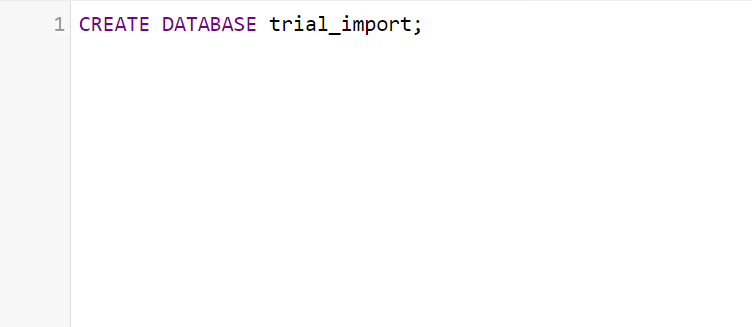

### 4. Pilih tab 'Import' dan selanjutnya pilih file .sql yang akan diimpor.

<p align="left">
      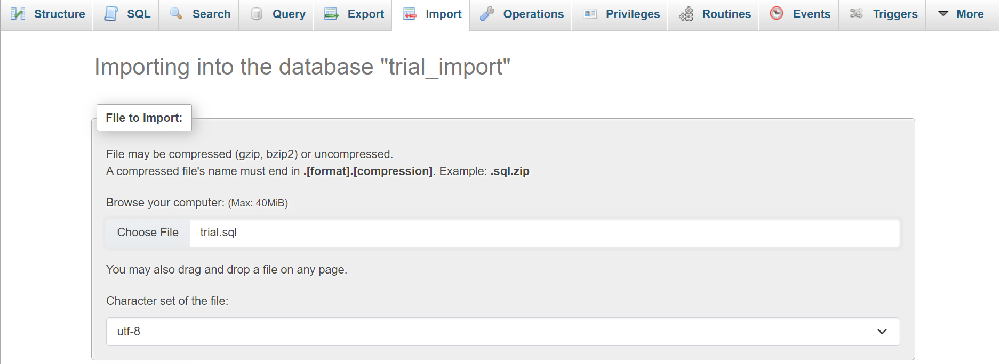

### 5. Tekan tombol 'Import' yang berada di bagian bawah halaman.

<p align="left">
      
      
### 6. Jika muncul pemberitahuan sukses, proses impor database telah berhasil dilakukan.

<p align="left">
      

### Berikut database yang digunakan setiap contoh yang ada dimodul:
1. Database yang digunakan pada materi Perintah DML dan Operasi Logika
- [**Database 1**](https://drive.google.com/file/d/1Z1BBdEBrBwT3dyFmI-hcsJHXeSjO5RC_/view?usp=sharing)
2. Database yang digunakan pada materi Operasi Himpunan, Operasi Aritmatika, dan Operasi Agregasi
- [**Database 2**](https://drive.google.com/file/d/1LFwdyB5TMe5wzsV_r3JQHNKJBdtVaUYU/view?usp=drive_link)
3. Database yang digunakan pada materi SQL Join dan Subquery
- [**Database 3**](https://drive.google.com/file/d/1zSe0ynU3dlVgcbSgizODrmFGeTYpfmbx/view?usp=drive_link)
  
## A. PENGENALAN DATA MANIPULATION LANGUAGE
DML merupakan singkatan dari Data Manipulation Language. Ini merupakan subset dari SQL (Structured Query Language) dengan perintah utamanya yaitu SELECT, INSERT, DELETE, dan UPDATE yang digunakan untuk memodifikasi, memasukkan, memperbarui, dan menghapus data dalam basis data relasional. Perintah DML digunakan untuk berinteraksi dengan data yang disimpan dalam tabel basis data.
Perintah DML sangat penting untuk mengelola dan mempertahankan integrasi sebuah basis data. 
Dengan menggunakan perintah DML, pengguna dapat memastikan bahwa data yang disimpan dalam basis data akurat, terbaru, dan relevan dengan kebutuhan.

## B. PERINTAH PADA DATA MANIPULATION LANGUAGE 
### 1. SELECT
SELECT merupakan perintah DML yang digunakan untuk memilih dan 
menampilkan nilai yang ada pada tabel. 
Berikut merupakan syntax penulisan untuk perintah SELECT:

- **Menampilkan seluruh data**

```sql
SELECT * FROM nama_tabel;
```
<p align="center">

</p>

- **Menampilkan data pada kolom tertentu**

``` sql
SELECT kolom-1, kolom-2, …, kolom-n
FROM nama_tabel;
```

<p align="center">

</p>

- **Menampilkan data kondisi tertentu**

```sql
SELECT kolom-1, kolom-2, …, kolom-n
FROM nama_tabel
WHERE kondisi;
```

<p align="center">

</p>

- **Menampilkan data berdasarkan nilai yang berbeda saja**

```sql
SELECT DISTINCT kolom-1, kolom-2, …, kolom-n
FROM nama_tabel;
```
<p align="center">

</p>

- **Menampilkan data secara terurut**

```sql
SELECT kolom-1, kolom-2, …, kolom-n
FROM nama_tabel
ORDER BY nama_kolom ASC/DESC;
```
<p align="center">

</p>

<br>
(ASC: Menampilkan data dari nilai terkecil ke terbesar. DESC: menampilkan data dari nilai terbesar ke terkecil.)
<br>
<br>
Selain syntax di atas, terdapat beberapa command tambahan yang dapat ditambahkan pada perintah SELECT seperti berikut: 

- **Menggabungkan dan menampilkan dua kolom**

```sql
SELECT CONCAT ( kolom-1, kolom-2)
FROM nama_tabel;
```

<p align="center">

</p>

Query diatas akan menampilkan data dengan cara menggabungkan data didua kolom, yaitu kolom nama dan kolom jabatan.

- **Menampilkan kolom dengan nama lain**

```sql
SELECT nama_kolom AS nama_alias
FROM nama_tabel;
```

<p align="center">

</p>

- **Menyalin data dari satu tabel ke dalam tabel baru (insert into)**

### 2. INSERT
INSERT merupakan perintah DML yang digunakan untuk menambahkan data pada tabel. Berikut merupakan penulisan syntax pada perintah INSERT:
- **Menampilkan data dengan kolom dan nilai yang spesifik**
  
```sql
INSERT INTO nama_tabel (kolom-1, kolom-2, …, kolom-n)
VALUES (nilai-1, nilai-2, …, nilai-n);
```

<p align="center">

</p>

- **Menambahkan data hanya dengan memanggil value tanpa nama memanggil nama kolom**
  
```sql

INSERT INTO nama_tabel
VALUES (nilai-1, nilai-2, …, nilai-n);
```

<p align="center">

</p>

- **Menambahkan beberapa baris data sekaligus**
```sql
INSERT INTO nama_tabel (kolom-1, kolom-2, …, kolom-n)
VALUES (nilai-1, nilai-2, …, nilai-n), (nilai-1, nilai-2, …, nilai-n);
```

<p align="center">

</p>

### 3. UPDATE
UPDATE merupakan perintah yang berfungsi untuk mengubah ataupun 
memperbarui data yang sudah ada di dalam tabel. Berikut merupakan syntax yang digunakan pada perintah UPDATE

```sql
UPDATE nama_tabel 
SET kolom-1 = nilai-1, kolom-2 = nilai-2, kolom-n = nilai-n 
WHERE kondisi;
```

<p align="center">

</p>

Syntax tersebut akan mengubah data pada tabel karyawan dengan nama ‘John Doe’ pada tabel usia menjadi 32 dan jabatan menjadi manajer proyek.

### 4. DELETE
DELETE seperti namanya merupakan sebuah perintah yang berfungsi untuk 
menghapus data yang ada di dalam tabel. Berikut merupakan syntax yang digunakan untuk melakukan perintah DELETE

```sql
DELETE FROM nama_tabel 
WHERE kondisi;
```

<p align="center">

</p>

Syntax ini akan menghapus data karyawan dengan nama ‘John Doe’ di tabel karyawan

## C. OPERATOR LOGIKA
### 1. AND
Operator AND digunakan untuk mengembalikan record data apabila kedua 
kondisi yang diberikan bernilai benar atau true. Berikut merupakan syntax yang digunakan untuk menggunakan operator AND

```sql
SELECT * FROM nama_tabel 
WHERE kondisi-1 AND kondisi-2 AND kondisi-n;
```

<p align="center">

</p>

Syntax ini akan menampilkan data di tabel karyawan dengan kondisi usia kurang dari 30 dan gaji lebih besar dari 4000.


### 2. IN 
Operator IN digunakan untuk menggantikan kondisi OR yang berulang dalam SELECT, INSERT, UPDATE, atau DELETE. Kita juga dapat menggunakan NOT IN untuk meminimalkan list pada rows data yang kita gunakan. Berikut merupakan syntax yang digunakan untuk menggunakan operator IN

```sql
SELECT * FROM nama_tabel 
WHERE nama_kolom IN (nilai-1, nilai-2, …, nilai-3);
```

<p align="center">

</p>

Syntax ini akan menampilkan data di tabel karyawan dengan kondisi nama karyawannya, yaitu ‘John Doe’,  ‘Jane Smith’, ‘Alice Johnson’. 

### 3. OR
Operator OR digunakan untuk mengembalikan record data apabila salah satu 
kondisi yang diberikan bernilai benar atau true. Berikut merupakan syntax yang digunakan untuk menggunakan operator OR

```sql
SELECT * FROM nama_tabel 
WHERE kondisi-1 OR kondisi-2 OR kondisi-n;
```

<p align="center">

</p>

Syntax ini akan menampilkan data di table karyawan dengan kondisi usia kurang dari 30 atau gaji diatas 4000. Maka memungkinakan akan mengambil data karyawan yang usia kurang dari 30 dan gaji kurang dari 4000, usia yang lebih dari 30 dan gaji lebih besar dari 4000, usia yang kurang dari 30 dan gaji lebih besar dari 4000. Dengan kata lain mengambil data jika salah satu kondisi adalah True.

### 4. NOT 
Operator NOT digunakan untuk mengembalikan record data apabila kondisi 
yang diberikan bernilai tidak benar atau not true. Berikut merupakan syntax yang digunakan untuk menggunakan operator NOT

```sql
SELECT * FROM nama_tabel 
WHERE NOT kondisi
```

<p align="center">

</p>

<p align="center">

</p>

### 5. LIKE
Operator LIKE digunakan bersama dengan syntax WHERE untuk mencari pola yang ditentukan dalam sebuah kolom. Berikut merupakan syntax yang digunakan untuk menggunakan operator LIKE :
- % Digunakan untuk nol atau lebih dari satu karakter.
- _  Digunakan untuk hanya satu karakter, yang berarti panjangnya tetap.

```sql
SELECT * FROM nama_tabel
WHERE nama_kolom LIKE '(karakter)%';
```
<p align="center">

</p>

Syntax ini akan menampilkan data di tabel karyawan dengan kondisi nama karyawan diawali dengan huruf a.

## D. OPERASI HIMPUNAN
### 1. UNION (∪)
UNION merupakan operator yang mengembalikan nilai dari dua tabel atau lebih dengan menggabungkan perintah SELECT **tanpa mengembalikan nilai duplikat.** Ada beberapa aturan untuk menggunakan UNION yaitu kolom pada tabel yang digabungkan harus memiliki jumlah dan tipe data yang sama selain itu urutan kolom pada tabel yang digabungkan juga harus sama. Berikut merupakan syntax dari operator UNION : 
- Menampilkan angka yang terdapat pada tabel_1 dan tabel_2 tanpa mengembalikan duplikatnya 

```sql
SELECT kolom-1, kolom-2, …, kolom-n
FROM nama_tabel
WHERE kondisi

UNION

SELECT kolom-1, kolom-2, …, kolom-n
FROM nama_tabel
WHERE kondisi;
```

<p align="center">
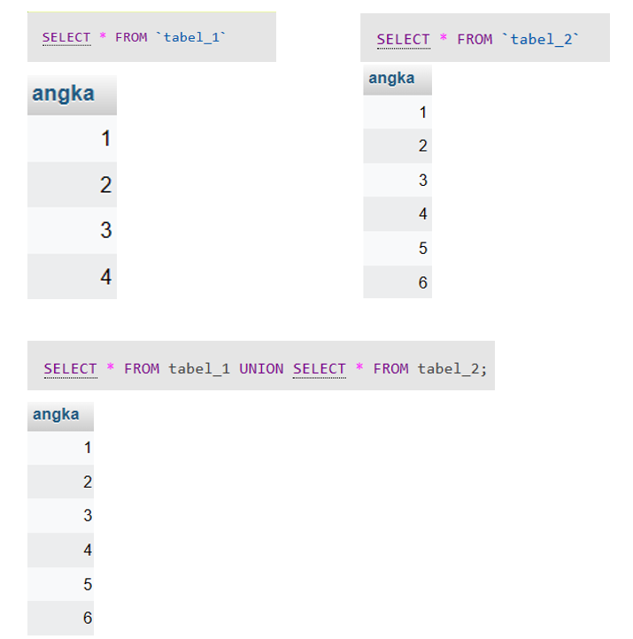
</p>


UNION ALL merupakan operator yang mengembalikan nilai dari dua tabel atau lebih dengan menggabungkan perintah SELECT **dengan mengembalikan nilai duplikatnya.** Perbedaan UNION dan UNION ALL terletak pada pengembalian nilainya jika UNION tidak mengembalikan nilai duplikatnya sedangkan UNION ALL mengembalikan nilai duplikatnya. Berikut merupakan syntax dari UNION ALL : 

- Menampilkan angka pada tabel_1 dan tabel_2 dengan mengembalikan nilai duplikatnya

```sql
SELECT kolom-1, kolom-2, …, kolom-n
FROM nama_tabel
WHERE kondisi

UNION ALL

SELECT kolom-1, kolom-2, …, kolom-n
FROM nama_tabel
WHERE kondisi;
```
<p align="center">

</p>

### 2. INTERSECT (∩)
INTERSECT merupakan operator yang mengambil irisan dari dua perintah SELECT. Berikut merupakan syntax dari INTERSECT : 
- Menampilkan angka pada tabel_1 yang ada juga pada tabel_2

```sql
SELECT kolom-1, kolom-2, …, kolom-n
FROM nama_tabel 
WHERE nama_kolom IN (
SELECT kolom-1, kolom-2, …, kolom-n
FROM nama_tabel);
```
<p align="center">

</p>


### 3. EXCEPT (-)
EXCEPT merupakan operator yang hanya mengembalikan data unik atau eksklusif pada tabel pertama tetapi yang tidak ada pada tabel kedua. Yang dimaksud data unik atau eksklusif tersebut yaitu tidak ada yang menyamai datanya pada tabel kedua. Berikut merupakan syntax dari EXCEPT :
- Menampilkan angka yang ada pada tabel_2 tetapi tidak ada pada tabel_1

```sql
SELECT kolom-1, kolom-2, …, kolom-n
FROM nama_tabel
WHERE nama_kolom NOT IN(
SELECT kolom-1, kolom-2, …, kolom-n
FROM nama_tabel);
```
<p align="center">

</p>

## E. OPERATOR ARITMATIKA
### 1. Penjumlahan (+)
Penjumlahan digunakan untuk menambahkan dua nilai.
- Menampilkan kolom angka yang nilainya ditambah 5

```sql
SELECT kolom1, kolom2, kolom2 + bilangan FROM nama_tabel;
```
<p align="center">

</p>

### 2. Pengurangan (-)
Pengurangan digunakan untuk mengurangkan satu nilai dari nilai lainnya.
- Menampilkan kolom angka yang nilainya dikurangi 5

```sql
SELECT kolom1, kolom2, kolom2 - bilangan FROM nama_tabel;
```
<p align="center">
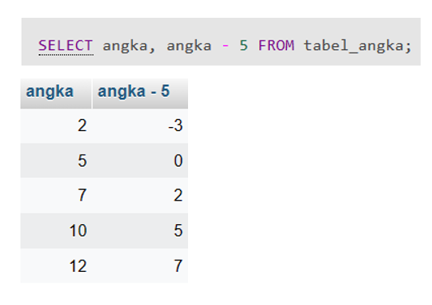
</p>

### 3. Perkalian (*)
Perkalian digunakan untuk mengalikan dua nilai.
- Menampilkan kolom angka yang nilainya dikali 5

```sql
SELECT kolom1, kolom2, kolom2 * bilangan FROM nama_tabel;
```
<p align="center">

</p>

### 4. Pembagian (/)
Pembagian digunakan untuk membagi satu nilai dengan nilai lainnya.
- Menampilkan kolom angka yang nilainya dibagi 5

```sql
SELECT kolom1, kolom2, kolom2 / bilangan FROM nama_tabel;
```
<p align="center">
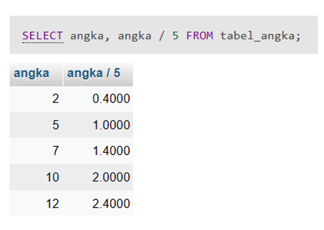
</p>

### 5. Modulus (%)
Modulus digunakan untuk mendapatkan sisa hasil bagi dari kedua nilai.
- Menampilkan kolom angka yang nilainya dimodulus atau sisa hasil bagi

```sql
SELECT kolom1, kolom2, kolom2 % bilangan FROM nama_tabel;
```
<p align="center">

</p>

## F. OPERATOR AGREGASI
Operator Agregasi atau biasa dikenal fungsi agregat merupakan operator yang digunakan untuk meringkas data dalam sebuah tabel. Operator ini dapat digunakan dalam berbagai pernyataan DML, seperti SELECT, GROUP BY, dll.
<br> Berikut merupakan contoh dari penggunaan operator agregasi di SQL : 
### 1. SUM
SUM digunakan untuk menghitung total nilai dalam satu kolom.
- Menampilkan total nilai pada kolom angka dari tabel angka

```sql
SELECT SUM(nama_kolom) FROM nama_tabel;
```
<p align="center">
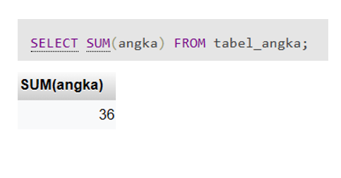
</p>

### 2. AVG
AVG digunakan untuk menghitung rata-rata nilai dalam satu kolom.
- Menampilkan rata-rata nilai pada kolom angka dari tabel angka

```sql
SELECT AVG(nama_kolom) FROM nama_tabel;
```
<p align="center">
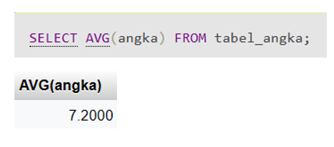
</p>

### 3. MIN
MIN digunakan untuk mencari nilai minimum pada suatu kolom.
- Menampilkan nilai terkecil pada kolom angka dari tabel angka

```sql
SELECT MIN(nama_kolom) FROM nama_tabel;
```
<p align="center">
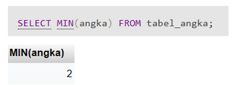
</p>

### 4. MAX
MAX digunakan untuk mencari nilai maksimum pada suatu kolom.
- Menampilkan nilai terbesar pada kolom angka dari tabel angka

```sql
SELECT MAX(nama_kolom) FROM nama_tabel;
```
<p align="center">

</p>

### 5. COUNT
COUNT digunakan untuk menghitung jumlah baris yang ada pada tabel.
- Menampilkan jumlah baris pada kolom angka dari tabel angka

```sql
SELECT COUNT(nama_kolom) FROM nama_tabel;
```
<p align="center">
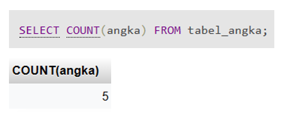
</p>


## G. OPERATOR PERBANDINGAN
### 1. Wildcard
Wildcard merupakan karakter khusus yang digunakan dalam operasi pencarian atau filtrasi data. Wildcard memungkinkan pengguna untuk mencocokkan pola tertentu dalam nilai data.
<br>

| Simbol        | Penggunaan    | Contoh      |
| :------------- |:-------------| :-------------|
| %      | Mewakili nol, satu, atau lebih karakter |‘baju%’ akan menemukan ‘bajubiru’, ‘bajumerah’|
| _      | Mewakili satu karakter |‘p_t’ akan menemukan ‘pat’, ‘pet’, ‘pit’, ‘pot’, ‘put’|
| [ ]      | Merepresentasikan karakter tunggal apa pun dalam tanda kurung siku |‘p[ao]t’ akan menemukan ‘pat’ dan ‘pot’|
| ^      | Mewakili karakter apa pun yang tidak ada di dalam tanda kurung |‘p[^ao]t’ akan menemukan pet’, ‘pit’, ‘put’, tetapi bukan ‘pat’ dan ‘pot’|
| -      | Mewakili berbagai karakter |c[a-d] akan menemukan cat, cbt, cct, dan cdt|. Tipe data ini dapat menyimpan data biner dengan panjang hingga 65,535 byte. |

```sql
SELECT * FROM table_name WHERE column_name LIKE 'baju%';
```
Syntax diatas akan menghasilkan baris-baris yang memiliki nilai kolom yang dimulai dengan "baju".

### 2. BETWEEN
BETWEEN digunakan untuk mengembalikan nilai dalam suatu range.
```sql
SELECT column_name
FROM table_name
WHERE column_name BETWEEN
value-1 AND value-2;
```

### 3. IN
IN digunakan untuk membandingkan data dengan list yang sudah ditentukan dengan memfilter hasil berdasarkan serangkaian nilai yang cocok dengan nilai dalam daftar tertentu.
```sql
SELECT * FROM table_name
WHERE column_name IN (condition-1,
condition-2, ..., condition-n);
```

### 4. DISTINCT
DISTINCT digunakan untuk mengembalikan nilai unik dari hasil query dengan menghilangkan record yang berisi duplikasi data pada saat data ditampilkan.
```sql
SELECT DISTINCT column_name FROM table_name;
```

### 5. LIMIT
LIMIT digunakan untuk membatasi jumlah baris yang akan ditampilkan.
```sql
SELECT column_name FROM table_name LIMIT number;
```

### 6. IS NULL
IS NULL digunakan untuk memeriksa suatu kolom memiliki nilai yang kosong (NULL).
```sql
SELECT column_name FROM table_name WHERE column_name IS NULL;
```

### 7. GROUP BY
GROUP BY digunakan untuk mengelompokkan data sesuai dengan kriteria yang diinginkan.
```sql
SELECT column_name FROM table_name GROUP BY column_name;
```

### 8. ORDER BY
ORDER BY digunakan untuk menyusun hasil query berdasarkan nilai-nilai dalam satu atau beberapa kolom. Pengurutan data dapat dilakukan secara naik (dari nilai terkecil ke terbesar) atau <i> ascending </i> **(ASC)**, maupun secara menurun (dari nilai terbesar ke terkecil) atau <i> descending</i> **(DESC)**.
```sql
SELECT column_name FROM table_name ORDER BY column_name
ASC/DESC;
```


## H. SUBQUERY
Subquery, yang juga dikenal sebagai nested query atau subselect, ialah bentuk query yang terdapat dalam query lain yang tertanam klausa SELECT, WHERE, atau FROM. Fungsi dari subquery adalah menghasilkan data yang akan digunakan dalam query utama untuk membatasi atau menyaring data yang akan diambil. Subquery digunakan untuk memberikan kondisi atau kriteria tambahan dalam proses pengambilan data. Berikut beberapa aturan dalam penggunaan subquery:
- Subquery harus diapit dalam tanda kurung.
- Penggunaan klausa ORDER BY tidak diperbolehkan dalam subquery. Klausa ORDER BY dapat digunakan dalam pernyataan SELECT utama.
- Klausa SELECT dalam subquery harus berisi satu nama kolom tunggal atau ekspresi, kecuali untuk subquery menggunakan kata kunci EXISTS.
- Secara default, nama kolom dalam subquery mengacu pada nama tabel dalam klausa FROM di query utama dengan cara mengkualifikasi nama kolom.
- Subquery tidak boleh digunakan sebagai operan dalam ekspresi.

```sql
SELECT nama_kolom
FROM nama_table
WHERE nama_kolom operator
      (SELECT nama_kolom
      FROM nama_table
      WHERE nama_kolom operator);
```
Berikut merupakan contoh penggunaan Subquery :
<br> Database data_mahasiswa terdiri atas tiga tabel, yakni mahasiswa, nilai_mahasiswa, dan mata_kuliah.
<p align="center">
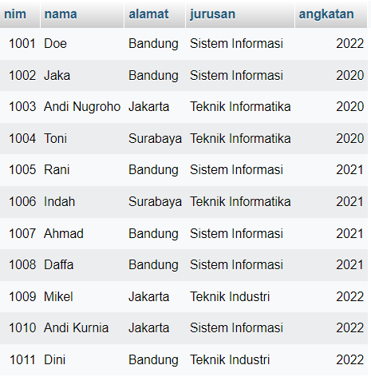
      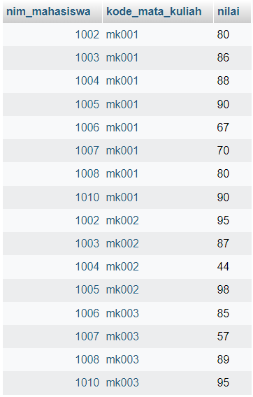
      
</p>
Subquery yang digunakan:

```sql
SELECT nama
FROM mahasiswa
WHERE nim IN
      (SELECT nim_mahasiswa
       FROM nilai_mahasiswa
       WHERE nilai > 80 AND kode_mata_kuliah = 'mk001');
```

Query tersebut digunakan untuk mengambil nama mahasiswa dari tabel "mahasiswa" yang memenuhi kondisi tertentu. Subquery di dalamnya berfungsi untuk mencari NIM mahasiswa dari tabel "nilai_mahasiswa" yang memiliki nilai di atas 80 dan memiliki kode mata kuliah 'mk001'. Hasil dari subquery ini, yaitu NIM mahasiswa yang memenuhi kondisi tersebut, kemudian digunakan sebagai kriteria dalam query utama. Dengan menggunakan klausa WHERE dan operator IN, query utama mengekstrak nama mahasiswa yang memiliki NIM sesuai dengan hasil subquery. Dengan demikian, hasil akhir dari query tersebut adalah daftar nama mahasiswa yang memenuhi syarat nilai di atas 80 pada mata kuliah 'mk001' seperti berikut.
<p align="center">

</p>


## I. SQL JOIN
### 1. CROSS JOIN
CROSS JOIN adalah jenis join yang menghasilkan hasil perkalian silang (cross product) dari dua tabel. Tabel yang dihasilkan dari CROSS JOIN akan berisi semua kombinasi baris dari kedua tabel, dan setiap baris pada tabel hasil akan mencakup semua atribut (kolom) dari tabel pertama dan tabel kedua. 
```sql
SELECT * FROM tabel-1 AS nama_alias-1 CROSS JOIN tabel-2 AS nama_alias-2;
```
Contoh:
```sql
SELECT *
FROM mahasiswa AS tb_mahasiswa
CROSS JOIN mata_kuliah AS tb_mk;
```
<p align="center">

</p>

Query ini akan menampilkan data yang diperoleh dari perkalian silang antara tabel mahasiswa dan tabel mata_kuliah. Jika diperhatikan pada tabel mata_kuliah hanya terdiri dari 3 baris, yaitu matakuliah Algoritma Pemrograman, Basis Data, dan Struktur Data. Sehingga setiap nama mahasiswa yang ada di tabel mahasiswa akan muncul sebanyak 3 kali dari hasil kali silang dengan tabel mata_kuliah.

### 2. RIGHT JOIN
RIGHT JOIN merupakan jenis join yang mengambil semua baris dari tabel kanan dan baris yang sesuai dari tabel kiri. Jika tidak ada kecocokan, kolom dari tabel kiri akan berisi nilai NULL.

```sql
SELECT kolom-1, kolom-2, .., kolom-n
FROM tabel-1
RIGHT JOIN tabel-2
ON tabel-1.nama_kolom = tabel-2.nama_kolom;
```
<p align="center">

</p>

Contoh:
```sql
SELECT mahasiswa.nim, mahasiswa.nama, nilai_mahasiswa.kode_mata_kuliah, nilai_mahasiswa.nilai
FROM mahasiswa
RIGHT JOIN nilai_mahasiswa 
ON mahasiswa.nim = nilai_mahasiswa.nim_mahasiswa;
```
<p align="center">
     
</p>

Query ini akan menampilkan semua data atau baris yang ada di tabel nilai_mahasiswa dengan nim yang ada di tabel nilai_mahasiswa sama dengan nim di tabel mahasiswa. Namun jika ada nim di tabel nilai_mahasiswa yang tidak terdapat di tabel mahasiswa maka kolom nim dan nama dari hasil querynya akan bertuliskan null.

### 3. LEFT JOIN
LEFT JOIN mengambil semua baris dari tabel kiri dan baris yang sesuai dari tabel kanan. Jika tidak ada kecocokan, kolom dari tabel kanan akan berisi nilai NULL.

```sql
SELECT kolom-1, kolom-2, .., kolom-n
FROM tabel-1
LEFT JOIN tabel-2
ON tabel-1.nama_kolom = tabel-2.nama_kolom;
```
<p align="center">
      
</p>

Contoh:
```sql
SELECT mahasiswa.nim, mahasiswa.nama, nilai_mahasiswa.kode_mata_kuliah, nilai_mahasiswa.nilai
FROM mahasiswa
LEFT JOIN nilai_mahasiswa 
ON mahasiswa.nim = nilai_mahasiswa.nim_mahasiswa;
```
<p align="center">
      
</p>

Query ini akan menampilkan semua data atau baris dari tabel mahasiswa dengan nim yang ada di tabel mahasiswa sama dengan nim di tabel nilai_mahasiswa. Namun, jika ada nim di tabel mahasiswa yang tidak terdapat di tabel nilai_mahasiswa maka kolom nim dan nama dari hasil querynya akan bertuliskan null.

### 4. INNER JOIN
INNER JOIN mengambil baris dari kedua tabel yang memiliki nilai yang sesuai berdasarkan kondisi yang diberikan. Baris yang tidak memiliki kecocokan diabaikan.
<p align="center">
      
</p>

```sql
SELECT a.nama_kolom-1, b.nama_kolom-2
FROM nama_tabel-1 a
JOIN nama_tabel-2 b
ON a.nama_kolom = b.nama_kolom;
```
atau dapat menggunakan klausa WHERE sebagai berikut:

```sql
SELECT a.nama_kolom-1, b.nama_kolom-2
FROM tabel-1 a, tabel-2 b
WHERE a.nama_kolom = b.nama_kolom;
```

dengan keterangan:
- a merupakan nama lain dari tabel 1
- b merupakan nama lain dari tabel 2
- ON digunakan untuk mengakses key dari tiap tabel dengan menghubungkan kedua tabel dengan menyebutkan kolom yang sama pada masing-masing tabel

Contoh:
```sql
SELECT tb_nilai.nim_mahasiswa, tb_matakuliah.nama_mk, tb_nilai.nilai
FROM nilai_mahasiswa tb_nilai
JOIN mata_kuliah tb_matakuliah
ON tb_nilai.kode_mata_kuliah = tb_matakuliah.kode_mk;
```

<p align="center">
      
</p>

Query ini akan menampilkan data yang ada di tabel nilai_mahasiswa dan tabel mata_kuliah jika kode matakuliah di kedua tabel tersebut sama.


